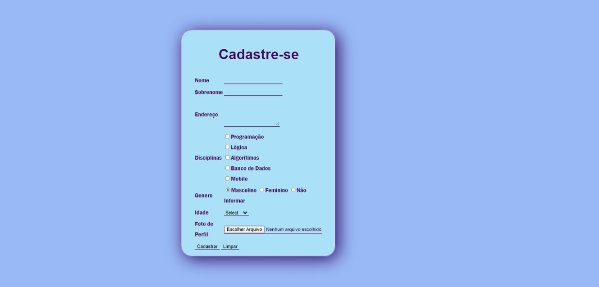

# Formulário de cadastro 💻
<h3> 📄📎 Este arquivo possui páginas de formulários, ligadas a partir do documento "index.html".</h3>

## Documentos: 
- [Formulário 1](./Paginas/formulario.html)
- [Formulário 2](./Paginas/index.html)
- [Formulário 3](./Paginas/login.html)
- [Página 4](./Paginas/pag.html)
 <h1 align="center"> </h1>
<h1 align="center"> </h1>
<h1 align="center"> </h1>
<h1 align="center"> </h1>